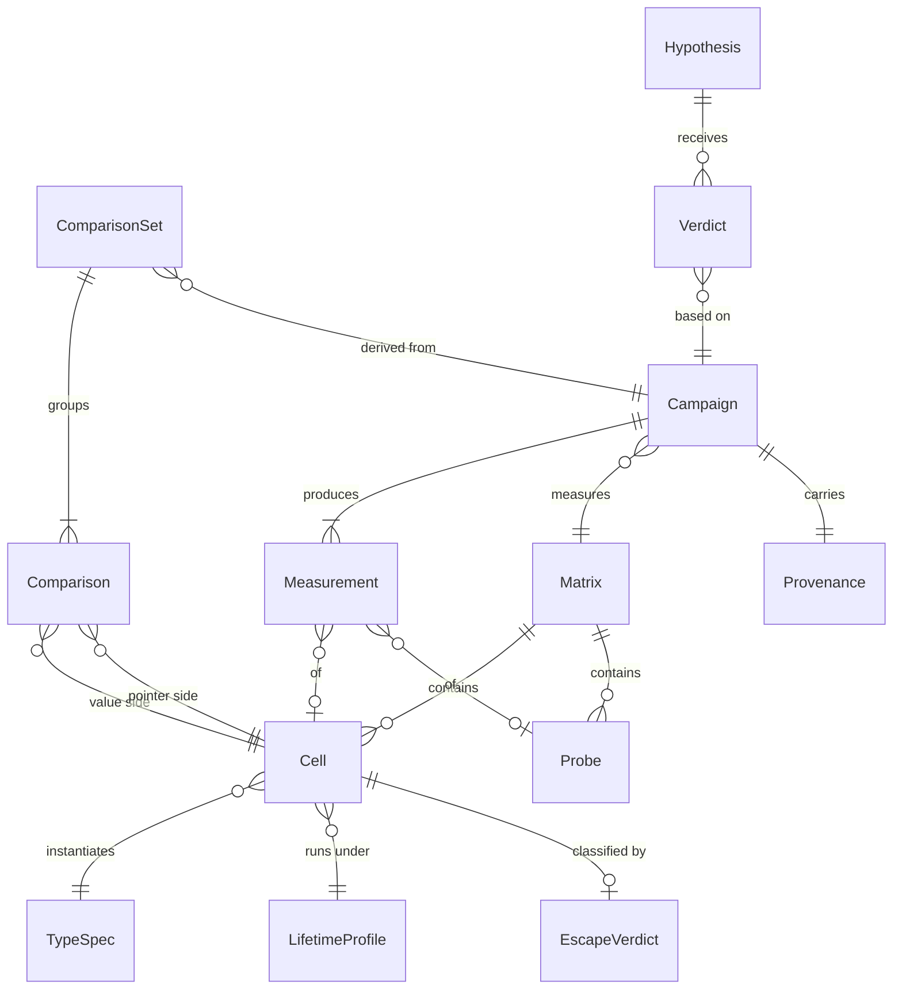

# Modèle d'entités — EscapeBench

Le modèle sert de glossaire : les noms ci-dessous sont repris tels quels dans les exigences, les cas d'utilisation, le code (`internal/models`) et les tests.

## TypeSpec

Description d'un type `struct` généré.

| Attribut | Type | Règles de validation |
|---|---|---|
| name | String | Requis, unique dans la matrice, identifiant Go valide |
| sizeBytes | Integer | Requis, multiple de 8 entre 8 et 4096 |
| wordCount | Integer | Dérivé : `sizeBytes / 8` sur 64 bits |
| hasPointerField | Boolean | Requis |

## LifetimeProfile

Profil de durée de vie d'une valeur dans le harnais, aligné sur les causes d'échappement de BEPG p. 238–242.

| Attribut | Type | Règles de validation |
|---|---|---|
| code | Enum | Requis ; valeurs : `LOCAL`, `RETURNED`, `CAPTURED_BY_CLOSURE`, `SENT_ON_CHANNEL`, `STORED_IN_MAP` |
| description | String | Optionnel |

## Cell

Unité de mesure : un `TypeSpec` × un `LifetimeProfile` × un mode de passage.

| Attribut | Type | Règles de validation |
|---|---|---|
| id | String | Requis, unique, immuable ; forme `<TypeSpec.name>/<LifetimeProfile.code>/<passingMode>` |
| passingMode | Enum | Requis ; valeurs : `VALUE`, `POINTER` |
| sourceFile | String | Requis ; chemin relatif du fichier Go généré |

## Probe

Sonde de mesure indépendante des TypeSpec (FR-006, H-004, H-005) ; mesurée par UC-003 comme une Cell, jamais classée par UC-002.

| Attribut | Type | Règles de validation |
|---|---|---|
| id | String | Requis, unique, immuable ; forme `probe/<kind>/<parameter>` (disjoint des identifiants de Cell : le deuxième segment n'est jamais un code de LifetimeProfile) |
| kind | Enum | Requis ; valeurs : `SEQUENTIAL_SCAN`, `SCATTERED_SCAN`, `APPEND_PREALLOC`, `APPEND_GROW` |
| parameter | Integer | Requis, > 0 ; jeu de travail en octets pour `*_SCAN`, nombre d'éléments pour `APPEND_*` |
| sourceFile | String | Requis ; chemin relatif du fichier Go généré |

## Matrix

| Attribut | Type | Règles de validation |
|---|---|---|
| id | String | Requis, unique ; forme `M-<sha256 court des paramètres>` |
| cells | Liste de Cell | Au moins une cellule |
| probes | Liste de Probe | Peut être vide ; jamais omise |
| generatedAt | DateTime (UTC) | Requis |

## EscapeVerdict

Résultat de la classification d'une cellule par le compilateur.

| Attribut | Type | Règles de validation |
|---|---|---|
| cellId | String | Requis, référence une Cell |
| escapes | Boolean | Requis |
| compilerReason | String | Ligne brute rapportée par `-gcflags=-m` ; vide si `escapes` est faux |
| category | Enum | Requis ; valeurs : `RETURN_POINTER`, `CLOSURE_CAPTURE`, `CHANNEL_SEND`, `CONTAINER_STORE`, `OTHER`, `NONE` |
| status | Enum | Requis ; valeurs : `OK`, `COMPILE_ERROR` ; `escapes` et `category` sont ignorés si `COMPILE_ERROR` |

## Provenance

| Attribut | Type | Règles de validation |
|---|---|---|
| goVersion | String | Requis ; sortie de `go version` |
| goos | String | Requis |
| goarch | String | Requis |
| cpuModel | String | Requis |
| capturedAt | DateTime (UTC) | Requis |

## Campaign

| Attribut | Type | Règles de validation |
|---|---|---|
| id | String | Requis, unique, immuable ; forme `C-<date>-<n>` |
| matrixId | String | Requis, référence une Matrix |
| harnessDigest | String | Requis ; empreinte SHA-256 de `internal/harness/` au démarrage |
| hypothesesDigest | String | Requis ; empreinte SHA-256 des énoncés et critères des Hypothesis liées, lus dans `docs/requirements.md` au démarrage |
| count | Integer | Requis, ≥ 20 (NFR-003) |
| status | Enum | Requis ; valeurs : `RUNNING`, `COMPLETED`, `ABORTED` |
| provenance | Provenance | Requis |

## Measurement

| Attribut | Type | Règles de validation |
|---|---|---|
| campaignId | String | Requis |
| subjectId | String | Requis ; identifiant d'une Cell ou d'une Probe de la Matrix |
| nsPerOp | Liste de Decimal | Exactement `count` valeurs |
| bytesPerOp | Liste de Integer | Exactement `count` valeurs |
| allocsPerOp | Liste de Integer | Exactement `count` valeurs |
| status | Enum | Requis ; valeurs : `COMPLETE`, `FAILED` ; les listes sont vides si `FAILED` |
| failureReason | String | Requis si `FAILED` |

## Comparison

| Attribut | Type | Règles de validation |
|---|---|---|
| campaignId | String | Requis |
| valueCellId | String | Requis ; `passingMode = VALUE` |
| pointerCellId | String | Requis ; même `TypeSpec` et même `LifetimeProfile` que `valueCellId`, `passingMode = POINTER` |
| deltaNsPerOp | Decimal | Médiane pointeur − médiane valeur |
| ciLow, ciHigh | Decimal | Bornes de l'intervalle de confiance à 95 % de `deltaNsPerOp` |
| significant | Boolean | Vrai si l'intervalle exclut zéro |

## ComparisonSet

Fichier de comparaison d'une Campaign (UC-004).

| Attribut | Type | Règles de validation |
|---|---|---|
| campaignId | String | Requis |
| computedAt | DateTime (UTC) | Requis |
| comparisons | Liste de Comparison | Au moins une |
| tippingPoints | Map (LifetimeProfile, hasPointerField) → Integer ou « non observé » | Une entrée par couple présent dans les Comparison |
| excludedPairs | Liste de { valueCellId, pointerCellId, reason } | Peut être vide ; jamais omise |

## Hypothesis

| Attribut | Type | Règles de validation |
|---|---|---|
| id | String | Requis ; forme `H-###` ; défini dans `requirements.md` |
| sourcePages | String | Requis |
| refutationCriterion | String | Requis, gelé au statut `Approved` du UC lié |

## Verdict

| Attribut | Type | Règles de validation |
|---|---|---|
| hypothesisId | String | Requis |
| campaignId | String | Requis |
| outcome | Enum | Requis ; valeurs : `CONFIRMED`, `REFUTED`, `INCONCLUSIVE` |
| rationale | String | Requis ; cite les cellules ou paires utilisées |
| resultFiles | Liste de String | Requis ; chemins des fichiers de résultats utilisés |
