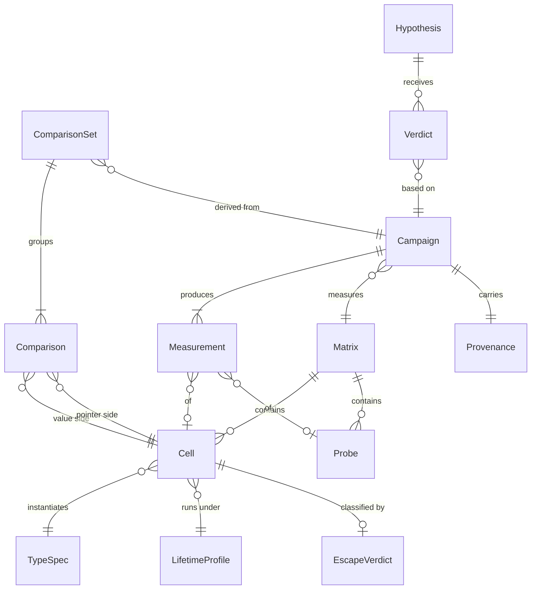

# Modèle d'entités — EscapeBench

Le modèle sert de glossaire : les noms ci-dessous sont repris tels quels dans les exigences, les cas d'utilisation, le code (`internal/models`) et les tests.

Révision du 2026-09-10, satisfaction de C-010 : `Measurement` porte une attestation de quiétude. Elle est facultative, comme les quatre champs de `Provenance` ajoutés par C-008 : un fichier de résultats antérieur reste valide. Elle ne participe à aucune identité et n'entre dans aucune empreinte.

Révision du 2026-09-10, satisfaction de C-009 : `Cell` porte un rang de réplicat. Il n'entre ni dans `Comparison`, ni dans `ComparisonSet.tippingPoints` : H-012 groupe ses réplicats par la taille, la disposition, la présence d'un champ pointeur et le profil, tous déjà présents dans `Comparison`, et les distingue par `valueCellId`. Faire entrer un champ de plus dans la clé des points de bascule rendrait H-002 non concluante sur toute campagne future, sans erreur ni trace. Ce qu'aucun critère ne lit, le modèle ne le porte pas. Corollaire assumé : le point de bascule d'une série répliquée n'est pas défini, le balayage descendant dépendant alors de l'ordre du fichier, et UC-004 ne le publie pas.

Révision du 2026-09-12, audit du code : `Campaign` porte les paramètres de mesure `benchTime` et `cpu`, sans lesquels une reprise (UC-003, A4) réutilisait les drapeaux de la ligne de commande du moment et non ceux sous lesquels les mesures déjà écrites ont été prises. Aucun critère de réfutation n'est touché.

Révision du 2026-09-10, synchronisée avec l'implémentation de UC-001 à UC-005 : `Matrix` porte ses paramètres normalisés et l'empreinte du harnais ; `EscapeVerdict` porte le message du compilateur en cas d'échec de compilation ; `Campaign` porte les identifiants d'hypothèses couverts et les horodatages de son cycle de vie ; `Comparison` recopie la taille, la présence d'un champ pointeur et le profil de sa paire ; `ComparisonSet` porte la matrice et la méthode d'estimation ; `Hypothesis` porte son énoncé et ses cas d'utilisation. Aucun de ces ajouts ne touche un critère de réfutation.

## TypeSpec

Description d'un type `struct` généré.

| Attribut | Type | Règles de validation |
|---|---|---|
| name | String | Requis, unique dans la matrice, identifiant Go valide ; porte la disposition, sauf `ARRAY_FILL` qui n'ajoute aucun marqueur pour que les identifiants antérieurs à C-008 restent inchangés |
| sizeBytes | Integer | Requis, multiple de 8 entre 8 et 4096 |
| wordCount | Integer | Dérivé : `sizeBytes / 8` sur 64 bits |
| hasPointerField | Boolean | Requis |
| layout | Enum | Requis ; valeurs : `ARRAY_FILL` (un mot de tête puis `Fill [n-1]uint64`), `NAMED_FIELDS` (`wordCount` champs déclarés un à un, sans tableau, donc assignable aux registres), `NAMED_FIELDS_SHAM` (même déclaration, témoin nul). Définies par C-008. Le témoin nul n'est produit que sur les tailles de 1 à 3 mots machine : le plancher de bruit de H-007 étant le plus grand écart de toute la série, un témoin de grande taille y fixerait un seuil supérieur au plus grand effet réel des tailles examinées |

## LifetimeProfile

Profil de durée de vie d'une valeur dans le harnais, aligné sur les causes d'échappement de BEPG p. 238–242.

| Attribut | Type | Règles de validation |
|---|---|---|
| code | Enum | Requis ; valeurs : `LOCAL`, `RETURNED`, `CAPTURED_BY_CLOSURE`, `SENT_ON_CHANNEL`, `STORED_IN_MAP`, et, ajoutés par C-008, `STORED_IN_SLICE`, `STORED_IN_STRUCT`, `RETURNED_ALLOCATING` |
| description | String | Optionnel |

Les cinq premiers profils forment la matrice de référence (BR-001-4) ; les trois derniers ne s'y trouvent pas et ne changent donc ni son décompte ni son identifiant. `RETURNED_ALLOCATING` appartient à la famille des retours : chaque instance produite s'accompagne d'une charge allouée, de sorte que le bras valeur alloue déjà (H-010).

## Cell

Unité de mesure : un `TypeSpec` × un `LifetimeProfile` × un mode de passage.

| Attribut | Type | Règles de validation |
|---|---|---|
| id | String | Requis, unique, immuable ; forme `<TypeSpec.name>/<LifetimeProfile.code>/<passingMode>`, le code du profil étant suffixé de `_R<n>` quand `repeat` dépasse un, puis de `_K<k>` quand `payload` dépasse un, puis de `_X<r>` quand `replicate` dépasse un |
| passingMode | Enum | Requis ; valeurs : `VALUE`, `POINTER` |
| repeat | Integer | Requis, ≥ 1, par défaut 1 ; instances produites par opération, seul le profil `RETURNED_ALLOCATING` s'en décline (C-008) |
| payload | Integer | Requis, ≥ 1, par défaut 1 ; charges allouées par instance, notées k, seul le profil `RETURNED_ALLOCATING` s'en décline. Le rapport d'allocations que mesure H-010 vaut (k + 1) / k : à k = 1 il vaut 2 par construction, quelle que soit la machine |
| replicate | Integer | Ajouté par C-009 ; requis, ≥ 1, par défaut 1 ; rang de cette mesure parmi les réplicats indépendants de la même paire. Seule la disposition `NAMED_FIELDS` en profil `LOCAL` s'en décline, et le réplicat est la dimension la plus extérieure de la génération : deux réplicats d'une même paire sont séparés par une passe complète de la matrice. Deux réplicats sont deux sujets, donc deux paquets Go, deux binaires et deux processus `go test` : c'est cette indépendance qui fait du plancher de bruit de H-012 une grandeur mesurée et non postulée |
| sourceFile | String | Requis ; chemin relatif du fichier Go généré |

## Probe

Sonde de mesure indépendante des TypeSpec (FR-006, H-004, H-005) ; mesurée par UC-003 comme une Cell, jamais classée par UC-002.

| Attribut | Type | Règles de validation |
|---|---|---|
| id | String | Requis, unique, immuable ; forme `probe/<kind>/<parameter>` (disjoint des identifiants de Cell : le deuxième segment n'est jamais un code de LifetimeProfile) |
| kind | Enum | Requis ; valeurs : `SEQUENTIAL_SCAN`, `SCATTERED_SCAN`, `APPEND_PREALLOC`, `APPEND_GROW`, et, ajouté par C-008, `POINTER_CHASE` |
| parameter | Integer | Requis, > 0 ; jeu de travail en octets pour `*_SCAN` et `POINTER_CHASE`, multiple de 64 et d'au moins deux nœuds ; nombre d'éléments pour `APPEND_*` |

Les deux parcours mesurent un débit : leurs chargements sont indépendants et se recouvrent. `POINTER_CHASE` mesure une latence : une itération de `b.N` vaut un seul accès, dont l'adresse a été lue à l'accès précédent (H-008).
| sourceFile | String | Requis ; chemin relatif du fichier Go généré |

## Matrix

| Attribut | Type | Règles de validation |
|---|---|---|
| id | String | Requis, unique ; forme `M-<sha256 court des paramètres>` |
| parameters | Objet | Requis ; paramètres normalisés de la demande (tailles, champ pointeur, profils, modes, Probe), base de `id` (BR-001-1) |
| harnessDigest | String | Requis ; empreinte SHA-256 des **gabarits embarqués** `internal/harness/templates/*.tmpl` à la génération (UC-001 étape 6, C-005). Elle ne couvre pas `internal/harness/harness.go`, qui façonne pourtant la source rendue : voir la limite consignée à C-005 |
| cells | Liste de Cell | Au moins une cellule |
| probes | Liste de Probe | Peut être vide ; jamais omise |
| generatedAt | DateTime (UTC) | Requis |

## EscapeVerdict

Résultat de la classification d'une cellule par le compilateur.

| Attribut | Type | Règles de validation |
|---|---|---|
| cellId | String | Requis, référence une Cell |
| escapes | Boolean | Requis |
| compilerReason | String | Ligne brute rapportée par `-gcflags=-m` ; vide si `escapes` est faux |
| category | Enum | Requis ; valeurs : `RETURN_POINTER`, `CLOSURE_CAPTURE`, `CHANNEL_SEND`, `CONTAINER_STORE`, `OTHER`, `NONE` ; `NONE` si et seulement si `escapes` est faux |
| status | Enum | Requis ; valeurs : `OK`, `COMPILE_ERROR` ; `escapes` et `category` sont ignorés si `COMPILE_ERROR` |
| compilerError | String | Requis si `COMPILE_ERROR`, vide sinon ; message du compilateur (UC-002, A2) |

## Provenance

| Attribut | Type | Règles de validation |
|---|---|---|
| goVersion | String | Requis ; sortie de `go version` |
| goos | String | Requis |
| goarch | String | Requis |
| cpuModel | String | Requis |
| l1DataCacheBytes | Integer | Ajouté par C-008 ; relevé sur la machine, jamais saisi. Zéro quand la détection échoue : une hypothèse qui en dépend se déclare alors non concluante |
| lastLevelCacheBytes | Integer | Ajouté par C-008 ; même règle |
| pageSizeBytes | Integer | Ajouté par C-008 ; consigné pour le diagnostic, aucun critère ne s'y adosse |
| gomaxprocs | Integer | Ajouté par C-008 ; consigné pour la comparaison avec les chiffres du livre |
| capturedAt | DateTime (UTC) | Requis |

Les quatre champs ajoutés par C-008 ne sont pas exigés par NFR-001 : un fichier de résultats antérieur reste valide, et ils ne participent pas à l'identité de la toolchain que compare UC-002 A3.

## Campaign

| Attribut | Type | Règles de validation |
|---|---|---|
| id | String | Requis, unique, immuable ; forme `C-<date>-<n>` |
| matrixId | String | Requis, référence une Matrix |
| harnessDigest | String | Requis ; empreinte SHA-256 des gabarits embarqués `internal/harness/templates/*.tmpl` au démarrage (même portée qu'à `Matrix.harnessDigest`) |
| hypothesesDigest | String | Requis ; empreinte SHA-256 des énoncés et critères des Hypothesis liées, lus dans `docs/requirements.md` au démarrage |
| hypothesisIds | Liste de String | Requis ; identifiants couverts par la campagne, base de `hypothesesDigest` (BR-003-5) |
| count | Integer | Requis, ≥ 20 (NFR-003) |
| benchTime | String | Durée `-benchtime` sous laquelle les Measurement ont été prises (C-003) ; absent si la valeur par défaut de la chaîne d'outils a été employée. Restituée à la reprise (UC-003, A4) |
| cpu | Integer | Valeur `-cpu` sous laquelle les Measurement ont été prises (C-003) ; absent si non imposée. Restituée à la reprise (UC-003, A4) |
| status | Enum | Requis ; valeurs : `RUNNING`, `COMPLETED`, `ABORTED` |
| provenance | Provenance | Requis |
| startedAt | DateTime (UTC) | Requis |
| finishedAt | DateTime (UTC) | Requis si `COMPLETED` ou `ABORTED` |
| abortReason | String | Requis si `ABORTED` (UC-003, A2) |

## Measurement

| Attribut | Type | Règles de validation |
|---|---|---|
| campaignId | String | Requis |
| subjectId | String | Requis ; identifiant d'une Cell ou d'une Probe de la Matrix |
| nsPerOp | Liste de Decimal | Exactement `count` valeurs |
| bytesPerOp | Liste de Integer | Exactement `count` valeurs |
| allocsPerOp | Liste de Integer | Exactement `count` valeurs |
| status | Enum | Requis ; valeurs : `COMPLETE`, `FAILED` ; les listes sont vides si `FAILED` |
| failureReason | String | Requis si `FAILED` |
| quietudeOccupancy | Decimal | Ajouté par C-010 ; facultatif ; fraction de la capacité de la machine consommée pendant la fenêtre de mesure par tout ce qui n'est pas le sujet, une fois retranché le travail de la campagne. Vaut de 0 à 1. Absent d'un fichier antérieur à C-010, et absent quand la plateforme ne sait pas le produire : H-013 se déclare alors non concluante plutôt que de supposer une quiétude |

## Comparison

| Attribut | Type | Règles de validation |
|---|---|---|
| campaignId | String | Requis |
| valueCellId | String | Requis ; `passingMode = VALUE` |
| pointerCellId | String | Requis ; même `TypeSpec` et même `LifetimeProfile` que `valueCellId`, `passingMode = POINTER` |
| sizeBytes, hasPointerField, layout, lifetimeProfile | Integer, Boolean, Enum, Enum | Requis ; attributs de la paire recopiés depuis son TypeSpec et son LifetimeProfile, pour que le fichier de comparaison suffise à évaluer H-001, H-002 et H-007 sans relire la Matrix (BR-005-2) |
| deltaNsPerOp | Decimal | Médiane pointeur − médiane valeur |
| medianValueNsPerOp, medianPointerNsPerOp | Decimal | Médianes des deux côtés, citées dans les rationales |
| ciLow, ciHigh | Decimal | Bornes de l'intervalle de confiance à 95 % de `deltaNsPerOp` |
| significant | Boolean | Vrai si l'intervalle exclut zéro |

## ComparisonSet

Fichier de comparaison d'une Campaign (UC-004).

| Attribut | Type | Règles de validation |
|---|---|---|
| campaignId | String | Requis |
| matrixId | String | Requis |
| computedAt | DateTime (UTC) | Requis |
| method | String | Requis ; méthode d'estimation de l'intervalle et ses paramètres |
| comparisons | Liste de Comparison | Au moins une |
| tippingPoints | Map (LifetimeProfile, layout, hasPointerField) → Integer ou « non observé » | Une entrée par triplet présent dans les Comparison. La disposition est entrée dans la clé le 2026-09-10 : sans elle, une campagne à plusieurs dispositions versait ses paires `ARRAY_FILL`, `NAMED_FIELDS` et `NAMED_FIELDS_SHAM` dans une même série, et le témoin nul, dont l'écart est nul par construction, suffisait à retourner le point de bascule. Une Comparison sans disposition, lue d'un fichier antérieur à C-008, compte pour `ARRAY_FILL` |
| excludedPairs | Liste de { valueCellId, pointerCellId, reason } | Peut être vide ; jamais omise |

## Hypothesis

| Attribut | Type | Règles de validation |
|---|---|---|
| id | String | Requis ; forme `H-###` ; défini dans `requirements.md` |
| sourcePages | String | Requis |
| statement | String | Requis ; énoncé réfutable, participe à l'empreinte gelée (BR-003-5) |
| refutationCriterion | String | Requis, gelé au statut `Approved` du UC lié |
| useCases | Liste de String | Cas d'utilisation porteurs ; déterminent le moment du gel |

## Verdict

| Attribut | Type | Règles de validation |
|---|---|---|
| hypothesisId | String | Requis |
| campaignId | String | Requis |
| outcome | Enum | Requis ; valeurs : `CONFIRMED`, `REFUTED`, `INCONCLUSIVE` |
| rationale | String | Requis ; cite les cellules ou paires utilisées |
| resultFiles | Liste de String | Requis ; chemins des fichiers de résultats utilisés |
