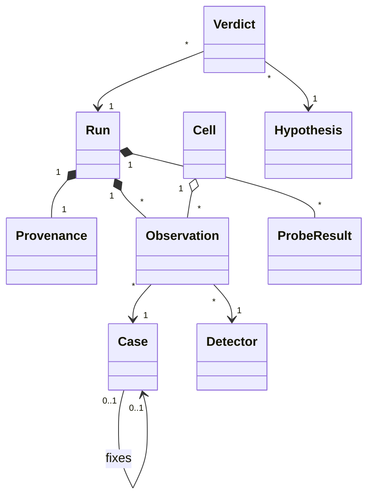

# Modèle d'entités — LeakLab

## Case

Un scénario minimal du corpus, dans son propre fichier du paquet `lab/corpus`. Sa vérité terrain est spécifiée dans `requirements.md` (corpus de référence) et vérifiée par l'oracle (FR-001).

| Attribut | Type | Description |
|---|---|---|
| id | string | Identifiant stable, en kebab-case (`dispatch-leak`) |
| antiPattern | enum | `GOROUTINE_LEAK`, `CHANNEL_DEADLOCK`, `FORGOTTEN_CANCEL`, `CONTEXT_IGNORED_IO`, `DATA_RACE`, `WITNESS` |
| page | int | Folio BEPG de l'affirmation ou de l'exemple ; 0 pour le témoin |
| faulty | bool | Le cas porte le défaut |
| leak | bool | Une goroutine au moins reste bloquée après le retour du scénario |
| blocks | bool | Le scénario ne rend jamais la main |
| race | bool | Le scénario contient une course de données |
| primitive | enum | `CHAN_SEND`, `CHAN_RECV`, `SELECT`, `WAITGROUP`, `COND`, `MUTEX`, `NET_READ`, `NONE` |
| reachable | bool | La primitive bloquante reste accessible depuis une racine du ramasse-miettes |
| static | enum | `LOST_CANCEL`, `CTX_IO`, `NONE` |
| fixes | string | Identifiant du cas fautif que ce cas corrige ; vide sinon |
| file | string | Fichier source du cas, relatif à `lab/corpus` |
| worker | string | Nom de la fonction qui apparaît dans la pile de la goroutine fuitée ou susceptible de l'être ; lu par l'oracle |
| scenario | func() error | Exécute le cas une fois ; rend une erreur si l'assertion fonctionnelle échoue |

## Detector

Énumération : `BARE`, `RACE`, `SYNCTEST`, `NUMGOROUTINE`, `LEAKPROFILE`, `PROGRAM` (dynamiques, C-006) ; `VET`, `CTXVET` (statiques).

## Run

Une campagne : l'exécution complète de la matrice et des sondes (UC-001).

| Attribut | Type | Description |
|---|---|---|
| id | string | `R-<AAAA-MM-JJ>-<n>` |
| provenance | Provenance | NFR-001 |
| reps | int | Répétitions par cellule et par bras, ≥ 5 |
| timeoutMs | int | Délai réel par observation dynamique (C-004) |
| criteriaDigests | map[string]string | Empreinte SHA-256 du critère de chaque hypothèse au démarrage (C-008) |
| observations | []Observation | Toutes les observations, dynamiques et statiques |
| probes | []ProbeResult | Toutes les mesures de sonde |
| startedAt, finishedAt | time | Horodatages UTC |

## Provenance

| Attribut | Type | Description |
|---|---|---|
| goVersion | string | `runtime.Version()` du binaire de mesure |
| goos, goarch | string | Plateforme |
| cpu | string | Identifiant du processeur tel que le système le rapporte |
| numCPU | int | Cœurs logiques |

## Observation

| Attribut | Type | Description |
|---|---|---|
| caseId | string | Cas observé |
| detector | Detector | Détecteur |
| rep | int | Numéro de répétition, à partir de 1 ; 1 pour un détecteur statique |
| outcome | enum | `PASS`, `FAIL`, `HANG`, `DEADLOCK`, `RACE`, `LEAK`, `DIAGNOSTIC` (C-005) |
| mentionsLeak | bool | La sortie contient un signalement au sens de H-002 |
| mentionsWitness | bool | La sortie contient `LEAKLAB-WITNESS` |
| durationMs | int | Temps réel du processus ou de l'analyse |
| detail | string | Première ligne significative (diagnostic, rapport, erreur), 200 caractères au plus |

## Cell

Entité dérivée, jamais stockée : les observations d'un couple cas × détecteur. Portent l'issue majoritaire (`diagnostiqué X` si plus de la moitié des répétitions valent X), `detected` et `unstable` au sens de `requirements.md`.

## ProbeResult

| Attribut | Type | Description |
|---|---|---|
| probe | enum | `SYNCTEST_TIMEOUT`, `CANCEL_RETENTION`, `TIMER_GROWTH` |
| arm | string | Bras (C-007) : `SYNCTEST`, `REAL` ; `<PARENT>/<MODE>`, `AFTERFUNC_WITNESS` ; `AFTER_IN_LOOP`, `REUSED_TIMER`, `RETAINED_WITNESS` |
| rep | int | Numéro de répétition |
| wallNs | int64 | Temps réel (SYNCTEST_TIMEOUT) |
| bytesPerOp | float64 | Octets de tas retenus par contexte ou par itération |
| goroutineDelta | int | Écart du nombre de goroutines (CANCEL_RETENTION) |

## Hypothesis

| Attribut | Type | Description |
|---|---|---|
| id | string | `H-###`, jamais réutilisé |
| source | string | Folio et affirmation |
| statement | string | Énoncé réfutable |
| criterion | string | Critère de réfutation, gelé (C-008) |

## Verdict

| Attribut | Type | Description |
|---|---|---|
| hypothesisId | string | Hypothèse jugée |
| runId | string | Campagne dont les résultats sont lus |
| outcome | enum | `CONFIRMED`, `REFUTED`, `INCONCLUSIVE` |
| rationale | string | Application du critère, avec les valeurs lues |
| evidence | []string | Cellules (`cas/détecteur`) ou bras de sonde cités |
